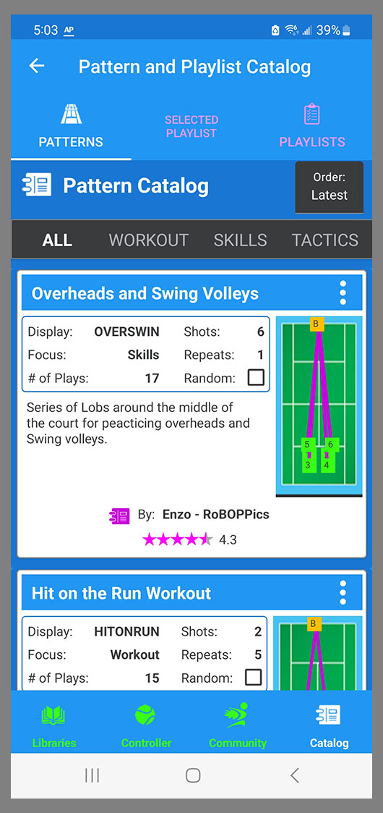
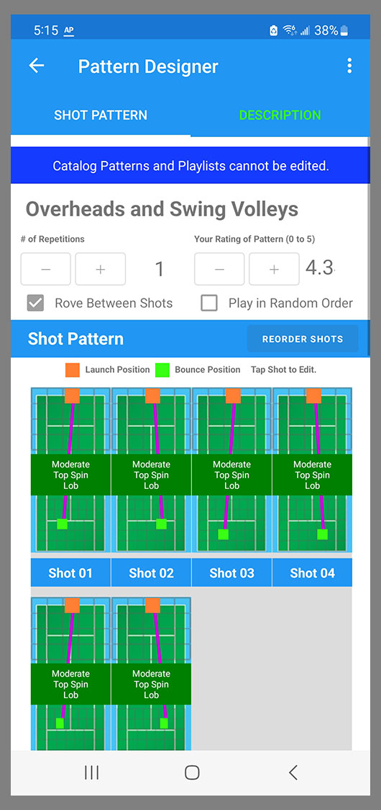
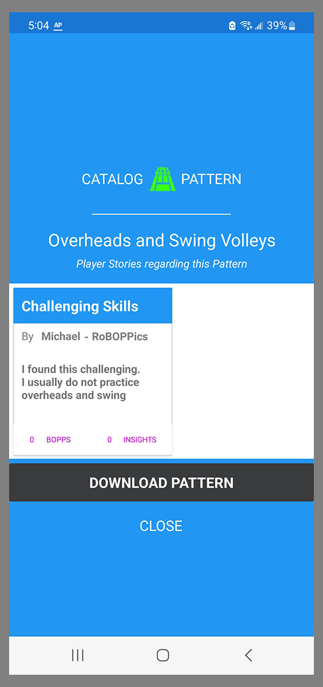

The Catalog is similar to the Pattern and Playlist Libraries in that it has the same three tabs: Patterns, Selected Playlist, and Playlists. 

{: width="300" .align-center } 

The difference between the Libraries and the Catalog is that everything in the Catalog is online and is available to all BallBOPPer users, while the Patterns and Playlists in your Libraries are only on your phone or tablet. 

The Catalog contains community Patterns and Playlists that you can browse through and download into your Pattern and Playlist Libraries.

Although you can drill down into the Pattern Designer and Shot Designer on Patterns and Playlists in the Catalog, you cannot edit them in the Catalog. Note the banner in the image below.

{: width="300" .align-center } 

And you cannot create a new Pattern or Playlist in the Catalog. 

Players and coaches create new Patterns and Playlists in the Patterns and Playlists Libraries, and then if they want to share them with other BallBOPPer players and coaches, they upload them to the Catalog. This is explained in the Pattern and Playlist Library section of this documentation under the Pattern and Playlist kabob menu items.

The player or coach can continue to upload new versions of their Patterns and Playlists to the Catalog over time, but only for the Patterns and Playlists that they authored. 

And note that the author of a Catalog pattern needs to retain the original of that Pattern or Playlist in their library.  If they delete the original copy of a Pattern or Playlist then they will no longer be able to update the version in the Catalog.

The menu items for uploading a Pattern or Playlist to the Catalog are found on the Kabob menu for each Pattern or Playlist in their respective libraries. See the Pattern and Playlist Libraries section for additional details.

When you tap the Kabob menu on a Pattern or Playlist in the Pattern and Playlist Catalog, you only have one option: Download Pattern or Download Playlist.

{: width="300" .align-center } 

Tapping on a Player Story will open it in the Player Story view.

Tapping on the DOWNLOAD PATTERN or DOWNLOAD PLAYLIST will download that item into your Pattern or Playlist Library. 

Once the Pattern or Playlist is in your Library, then you can Edit, Queue and Play the Pattern or Playlist the same as the Patterns and Playlists that you yourself have created.

You can edit the Patterns and Playlists that you download from the Catalog, the same as the Patterns and Playlists that you create, with one exception: you cannot change the "Byline" to the original author. 

Also if you look at the Kabob menu in the Pattern and Playlist Library on an item that you downloaded from the Catalog, you will note that the "Upload to Catalog" option is missing. The original author of the item in the Catalog is the only one who can upload a new version of it.

  <nav class="pagination">
      <a href="/BallBOPPer/community/" class="pagination--pager" title="Community">Previous</a>
       <a href="/BallBOPPer/robotmanintro/" class="pagination--pager" title="Robot Manual">Next</a>
  </nav>
