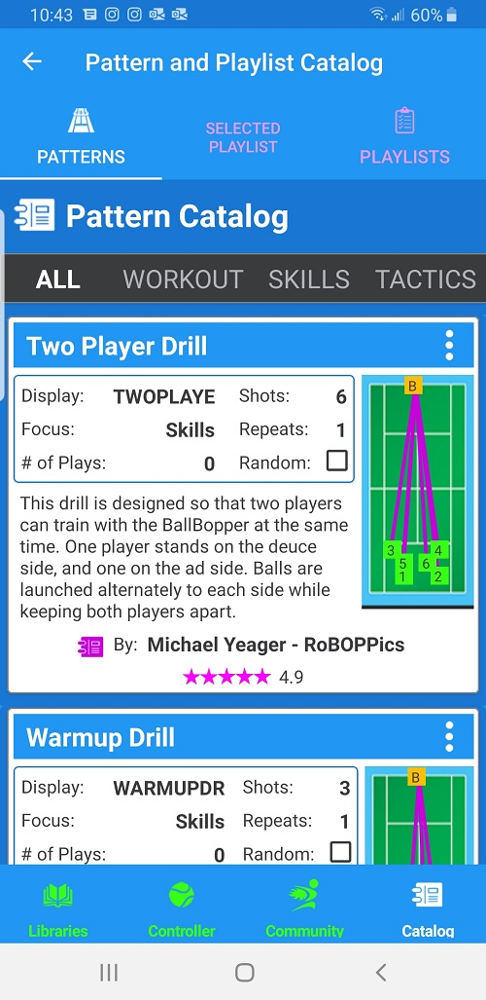

The Catalog is similar to the Pattern and Playlist Libraries in that it has the same three tabs: Patterns, Selected Playlist, and Playlists. 

The big difference is that everything in the catalog is online, and not on your phone or tablet. The Catalog contains additional Patterns and Playlists that you can browse through and download.

{: width="300" .align-center } 

You can also contribute your own Patterns and Playlists to the Catalog.

  <nav class="pagination">
      <a href="/BallBOPPer/community/" class="pagination--pager" title="Community">Previous</a>
      <a class="pagination--pager disabled">The End</a> 
  </nav>
