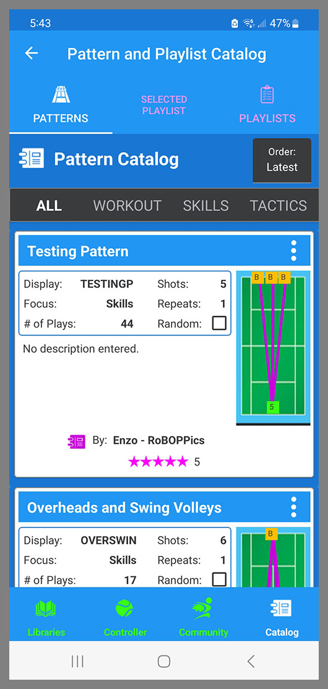

The Catalog is similar to the Pattern and Playlist Libraries in that it has the same three tabs: Patterns, Selected Playlist, and Playlists. 

{: width="300" .align-center } 

The big difference between the Libraries and the Catalog is that everything in the Catalog is online and is available to all BallBOPPer users, while the Patterns and Playlists in your Libraries are only on your phone or tablet. 

The Catalog contains community Patterns and Playlists that you can browse through and download into your Pattern and Playlist Libraries.

Two other difference: although you can drill down into the Pattern Designer and Shot Designer on Patterns in the Catalog, you cannot edit them; and you cannot create a new Pattern or Playlist in the Catalog. 

You create new Patterns and Playlists in the Patterns and Playlists Libraries, and then if you want to share them with other BallBOPPer users, you can upload them to the Catalog.

The menu items for uploading a Pattern or Playlist to the Catalog are found on the Kabob menu for each Pattern or Playlist in their respective libraries. See the Pattern and Playlist Libraries section for additional details.

When you tap the Kabob menu on a Pattern or Playlist in the Pattern and Playlist Catalog, you only have one option: Download Pattern or Download Playlist.

Tapping on this item will download the selected Pattern or Playlist into your Pattern or Playlist Library. 

You can then Edit, Queue and Play the Pattern or Playlist the same as the Patterns and Playlists that you have created.

Note that you can edit the Patterns and Playlists that you download from the Catalog with the one exception: you cannot change the Attribution to the original author. 

Also if you look at the Kabob menu on an item that you downloaded from the Catalog, you will note that the "Upload to Catalog" option is missing. The original author of the item in the Catalog is the only one who can update their own items in the Catalog. 

  <nav class="pagination">
      <a href="/BallBOPPer/community/" class="pagination--pager" title="Community">Previous</a>
       <a href="/BallBOPPer/robotmanintro/" class="pagination--pager" title="Robot Manual">Next</a>
  </nav>
