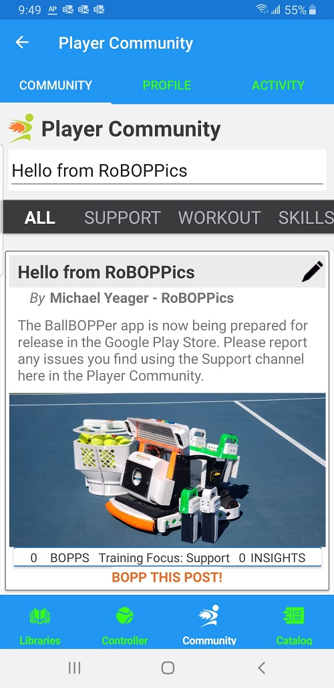

The Community has three tabs: Community, Profile and Activity.

## Community

The Community provides a place for users of the App to post their stories about their training experience into the community feed. 

Others can "Bopp" these stories, and can also add additional insights. 

The feed also contains instructional and support information. Set the filter at the top to the type of information you want to see.

{: width="300" .align-center } 

## Profile

The Player Profile page lists your basic information along with links to the user manuals and other resources.

## Activity

The Activity page lists everything you have created or played into the app. Each entry is a link to that item, giving you an easy way to go back to a Pattern, Playlist, Story or Insight that you created or enjoyed playing.

  <nav class="pagination">
      <a href="/BallBOPPer/coreController/" class="pagination--pager" title="Core Controller">Previous</a>
      <a href="/BallBOPPer/appmancatalog/" class="pagination--pager" title="Catalog">Next</a> 
  </nav>
