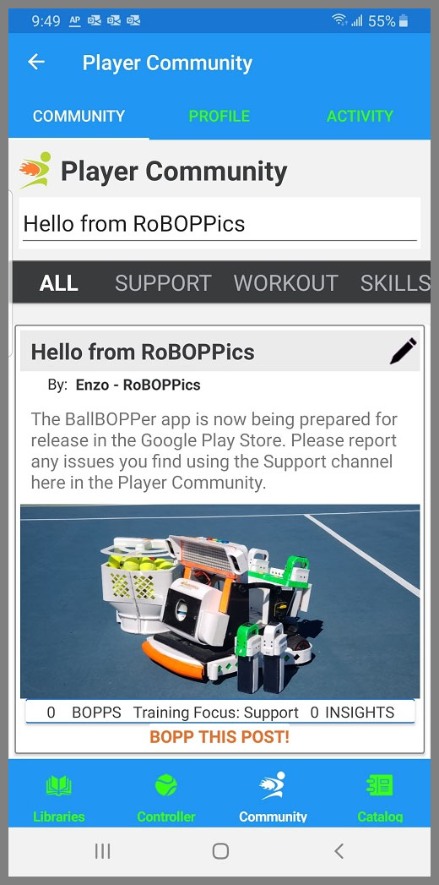

The Community has three tabs: Community, Profile and Activity.

## Community Feed

The Community Feed provides a place for users of the App to post stories regarding their training experiences using the BallBOPPer. 

You tap in the title of your story at the top of the page. Press enter. And you will be presented with the Story Entry form.

The form allows you to also add photos and videos of your training sessions.

All Stories are reviewed before they will appear in the feed to others. Only positive information will be approved. 

Users can "Bopp" the stories that they like, and they can also add their own additional "Insights". 

Users can also report Stories or Insights (using the flag button) that they feel are inappropriate.

The feed also contains instructional and support information curated by RoBOPPics. 

Set the filter at the top of the page to display the type of information you want to see. The choices currently are: All, Support, Workout, Skills, Tactics, Strategy, Mindset and Suggestions.

{: width="300" .align-center } 

## Profile

The Player Profile page lists, and lets you edit, your user information. 

It also contains links to the Privacy Policy, Terms and Conditions, Instruction and Operating Manuals and a link for reporting Issues.

## Activity

The Activity page is simply a list of everything you have created or played using the app. 

Each entry is a link to that item, giving you an easy way to go back to a Pattern, Playlist, Story or Insight that you created or enjoyed playing.

  <nav class="pagination">
      <a href="/BallBOPPer/coreController/" class="pagination--pager" title="Core Controller">Previous</a>
      <a href="/BallBOPPer/appmancatalog/" class="pagination--pager" title="Catalog">Next</a> 
  </nav>
