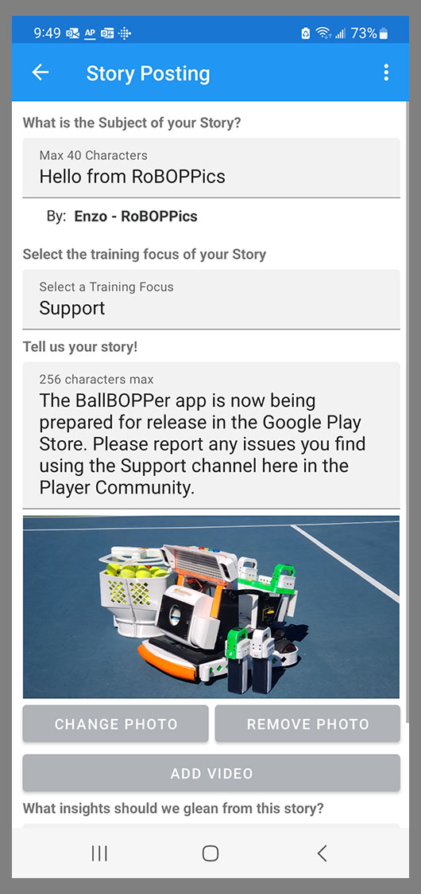

The Community has three tabs: Community, Profile and Activity.

## Community

The Community page provides a place for users of the App to post stories regarding their training experiences using the BallBOPPer. 

{: width="300" .align-center } 

Set the filter at the top of the page to display the type of information you want to see. The choices currently are: All, Support, Workout, Skills, Tactics, Strategy, Mindset and Suggestions.

## Post a Story

Tap the title box at the top of the page and enter the title of your Story. 

Press enter, and you will be presented with the Story Posting form.

{: width="300" .align-center }

The form allows you to also add photos and videos of your training sessions.

All Stories are reviewed before they will appear in the feed to others. Only positive information will be approved. 

The "Byline" that appears on all of your Patterns, Playlists, Stories, Bopps and Insights is a combination of the Player Name and Player Team that you entered into your Player Profile. See the Profile item below for more information.

## Story View

Tapping on a Story will open it in the Story view. Here you can see the full story including the info that other players have added.

{: width="300" .align-center }

Players can "Bopp" the stories that they like, and they can also add their own "Insights". 

Users can also report Stories or Insights that they feel are inappropriate using the flag button.

## Profile

The Player Profile page lists, and lets you edit, your user information. 

{: width="300" .align-center } 

It also contains links to the Privacy Policy, Terms and Conditions, Instruction and Operating Manuals and a link for reporting Issues.

The Community Content Byline appears on all of your Patterns, Playlists, Stories, Bopps and Insights. It is a combination of the Player Name and Player Team. Be sure to enter the information into the Player Name and Team fields to create the Byline that you want.

## Activity

The Activity page is simply a list of everything you have created or played using the app. 

{: width="300" .align-center } 

Each entry is a link to that item, giving you an easy way to go back to a Pattern, Playlist, Story or Insight that you created or enjoyed playing.

  <nav class="pagination">
      <a href="/BallBOPPer/coreController/" class="pagination--pager" title="Core Controller">Previous</a>
      <a href="/BallBOPPer/appmancatalog/" class="pagination--pager" title="Catalog">Next</a> 
  </nav>
