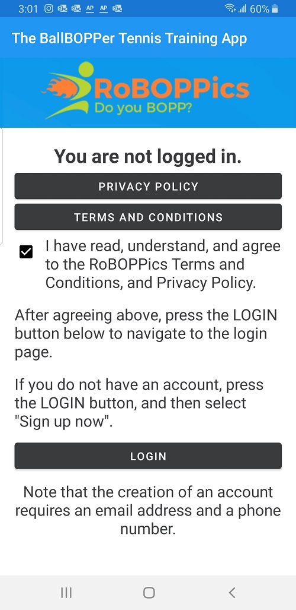
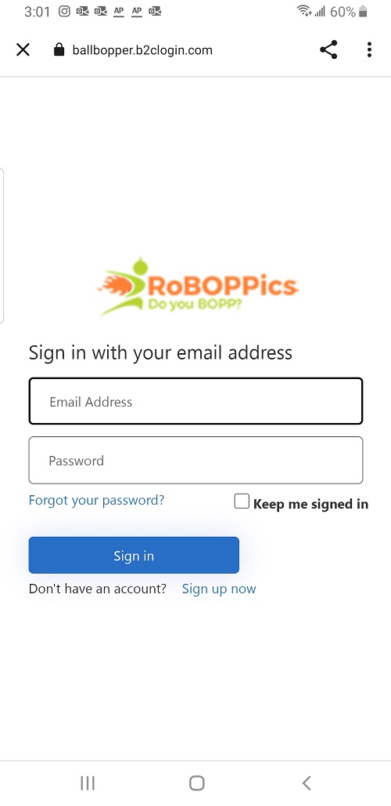

## Beta Login Not Required

Much of the beta version of the BallBOPPer App, that is currently available in the Google Play Store  (<a href="https://play.google.com/store/apps/details?id=com.RoBOPPics.bbapp18" >BallBOPPer App on Android</a>), can be navigated without having to log in. 

You can download the App onto your Android device, and then go through the App and explore the Pattern and Playlist Libraries, the Community, the Catalog, and the Controller. 

## Login

An email and password are all that is required to create a login for the beta App. This will allow you to create your own custom Patterns and Playlists, and add your own Stories into the Community feed.

{: width="300" .align-center } 

Clicking on the Privacy Policy, and Terms and Conditions buttons will take you to these documents so that you can read them.

Checking the box will indicate your agreement to them, and will light up the Login button.

Clicking on the Login button will take you to the login page.

{: width="300" .align-center } 

## Sign up now

If this is your first time logging in, you will need to setup your account. 

Click on "Sign up now".

During beta testing, only a username and password are required. 

When the BallBOPPer starts shipping to Players, two factor authentication will be enabled. You will then need to enter a verifiable email address, and a verifiable telephone number. These are required to prevent nefarious user's of the App from hijacking your BallBOPPer.

## Already have an account?

If you already have an account, enter your email address and password.

After logging in the first time, your credentials will be remembered by the App for up to 90 days.

  <nav class="pagination">
      <a href="/BallBOPPer/appQuickstart/" class="pagination--pager" title="App Reference">Previous</a>
      <a href="/BallBOPPer/patternLibraries/" class="pagination--pager" title="Pattern Libraries">Next</a> 
  </nav>
