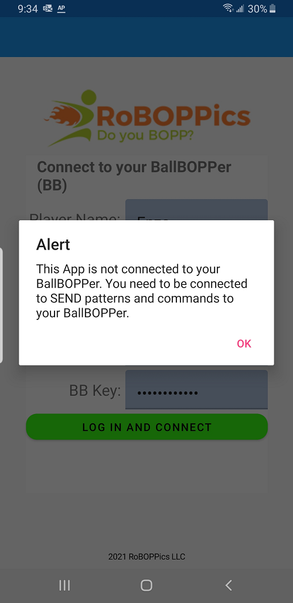
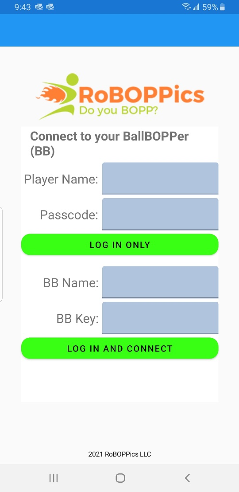

When you first launch the BallBOPPer, you will see the alert shown below indicating that you are not currently connected to your BallBOPPer.

{: width="300" .align-center } 

After clicking OK, you have two options: Log In Only, and Log In and Connect.

{: width="300" .align-center } 

## Log In Only
If have not created a Player Name and Password, then you will now be prompted to create one. Once you have these, you can use the "Log in Only" functionality.

"Log in Only" lets you log in, using your Player Name and Password, without connecting to a BallBOPPer.

This allows you to create and edit your Drills, Patterns and Playlists from wherever you want: at home, on the train, or during a break at work.

## Log In and Connect
"Log in and Connect" is for when you are on-court and ready to play.

You will need your Player Name and Password, along with the name of your BallBOPPer and the Key for your BallBOPPer.

The name and Key of your BallBOPPer are packaged with your BallBOPPer.

After you enter your Player Name, Password, BallBOPPer Name and Key, it will be remembered by the App. The only time you will ever need to reenter it again is when you change phones, or reinstall the App.

  <nav class="pagination">
      <a href="/BallBOPPer/appmanintro/" class="pagination--pager" title="Introduction">Previous</a>
      <a href="/BallBOPPer/patternLibraries/" class="pagination--pager" title="Pattern Libraries">Next</a> 
  </nav>
