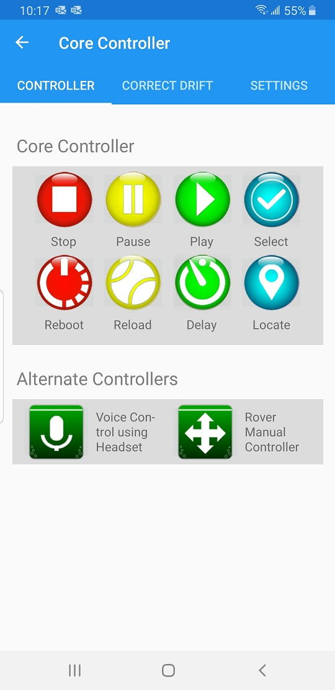
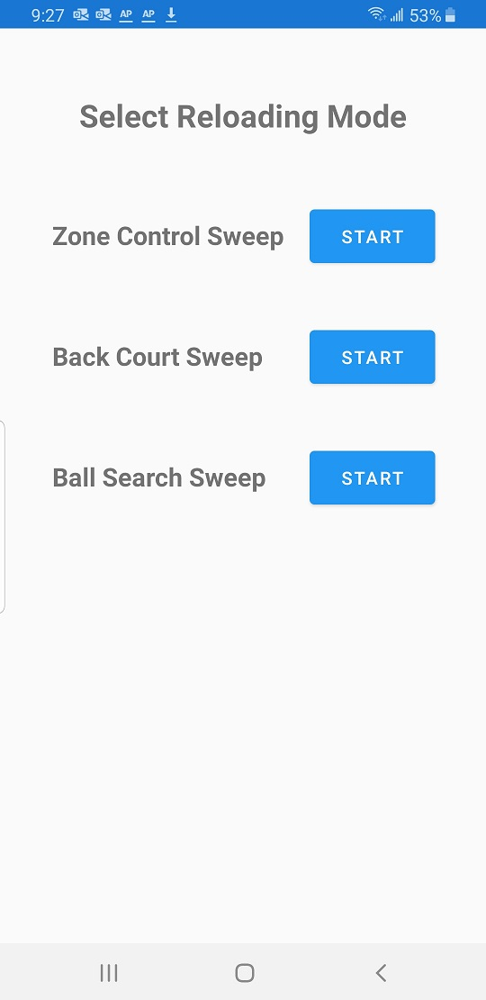
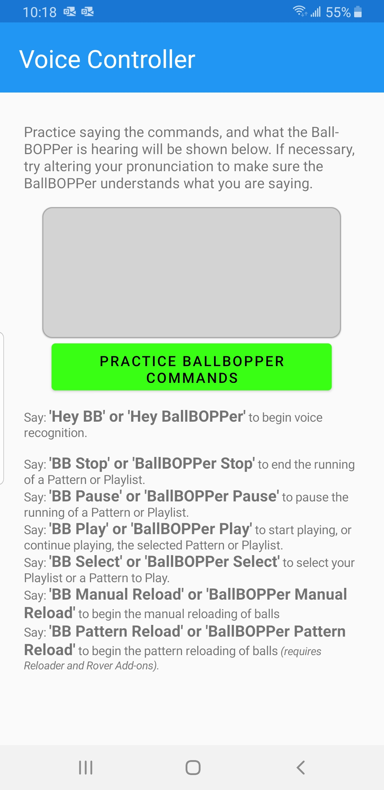
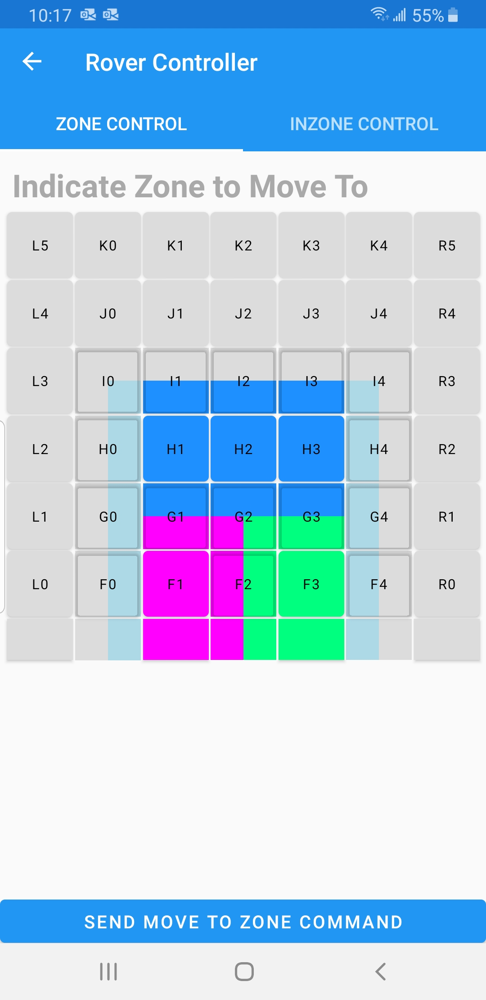
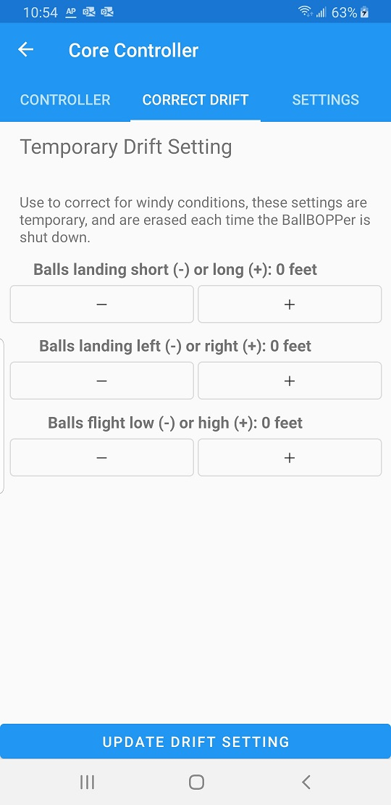
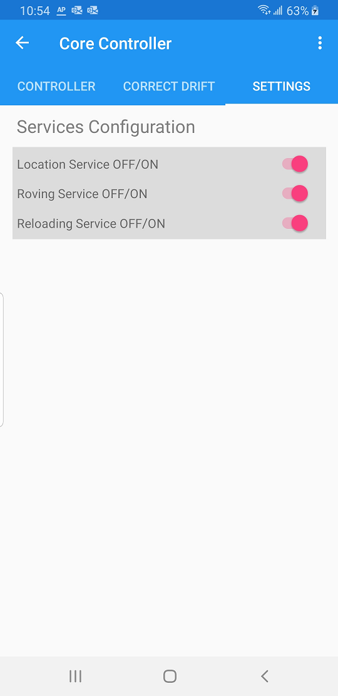

## Controller

The Core Controller gives you direct control over the BallBOPPer robot. 

When you press SELECT on any of the Patterns in a Pattern Library, the Pattern is transmitted to the robot, and the Controller pops up automatically in the App. Press PLAY and the robot will begin playing the Pattern. 

{: width="300" .align-center }

The eight buttons at the top of the Controller mirror the functions of the four physical buttons on the BallBOPPer robot.

The top row of buttons in the App: Stop, Pause, Play and Select; are the functions when you press the physical buttons on the robot.

The second row of buttons in the App: Reboot, Reload, Delay and Locate; are the functions when you press and hold for three seconds the physical buttons on the robot.

Reboot will reboot the BallBOPPer's onboard computer. 

Select is for selecting the Drill or Pattern you wish to play. Pressing Select in the App sends you back to the Pattern Libraries where you can select from all of the possibilities in the libraries. 

When you press the Select button on the robot, you can cycle through and select, using the buttons and display on the robot, from the Drills and Patterns that you have previously played on the robot. This makes it possible to play Drills and Patterns, those that you have previously played on the robot, when on-court without a smartphone or tablet (see the Robot Manual for more details). 

Delay will delay the beginning of the playing of a Drill or Pattern by 15 seconds each time it is pressed. Locate is used for calibrating the Location system before beginning a training session on an unfamiliar court.

Pressing Reload will present you with three ball reloading options: Zone Control Sweep, Back Court Sweep and Ball Search Sweep.

{: width="300" .align-center }

The Zone Control Sweep option gives you manual control over the ball reloading process. When you choose this option, you are presented with the Rover Zone Controller. You use the Zone Controller to send the BallBOPPer to a particular Zone on the court, and it will reload all of the balls it finds there. You can continue to send the BallBOPPer to the zones that contain balls until they are all collected.

With the Back Court Sweep option, the BallBOPPer will sweep the entire area behind the baseline of its side of the court, collecting all of the balls it finds there. 

With the Ball Search Sweep option, the BallBOPPer will use it's onboard cameras to locate concentrations of balls and plan and execute it's own reloading process.

Note that you can switch between these three methods as needed, to expedite the reloading of the balls. Also note that the robot will only reload the balls that are found on it's side of the court. See the Robot Manual for best practices when using the Reloading function.

## Alternate Controllers

### Voice Controller using Headset

The voice controller can be used with any sweatproof bluetooth headset that can be paired with your phone. 

It offers many of the same functions as the Core Controller, but you will find it much easier to run a training session without holding your smartphone in one hand. 

Your smart phone or tablet must still be present and running the App, but it can be safely left on the sideline in your bag or on the bench.

{: width="300" .align-center }

### Rover Zone Controller

The Rover Zone Controller is a positional controller that gives you the ability to send the BallBOPPer to a particular position on it's side of the court. 

{: width="300" .align-center }

Press the spot where you want the BallBOPPer to move to, and the BallBOPPer will travel to that spot, shutdown and wait. 

If you are using the Zone Controller in the context of the Zone Controller Sweep function, as explained above, then the robot will reload all of the balls it finds in the destination zone, and then wait to be sent to a different zone to repeat the ball reloading process.

## Correct-Drift

The Correct Drift page is specifically for correcting for windy, or other conditions, that are preventing the launched balls from bouncing on their spots. 

You can add or subtract distance, adjust the shots left or right, and elevate them higher or lower. These settings are temporary and revert to the default settings when you turn the BallBOPPer off.

{: width="300" .align-center }

## Settings

The three Settings on this page allow you to turn the Location, Rover and Reloader services On and Off. 

You may wish to not use the Rover and Reloader for various reasons, and you can therefore turn them off. 

If you are using the BallBOPPer in a location that is not a tennis court, such as your driveway or backyard, then the BallBOPPer will not be able to determine its location and will indicate an ERROR. 

The only way the BallBOPPer will operate when not on a tennis court is with the Location service turned Off. Also note that when you turn the Location service Off, it also turns Off the Rover and Reloader services. None of these three services will operate if you are not on a tennnis court. 

With the Location Service turned Off, you will need to manually position and point the Robot in the correct direction. You may also need to adjust the Launch and Bounce points in your patterns according to the space that is available. 

{: width="300" .align-center }

  <nav class="pagination">
      <a href="/BallBOPPer/shotDesigner/" class="pagination--pager" title="Shot Designer">Previous</a>
        <a class="pagination--pager disabled">The End</a> 
  </nav>
  

