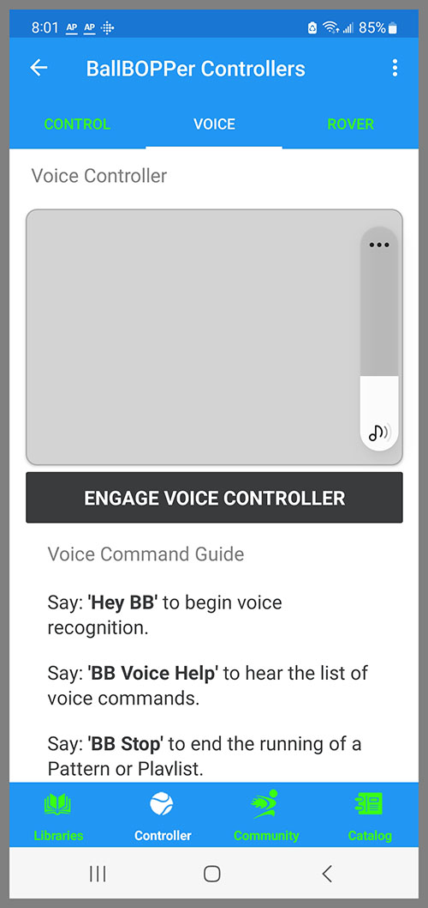

## Controller

The Controller section gives you direct control over the BallBOPPer robot. 

{: width="300" .align-center }

## Court Name

The name you have given to the court that you are currently training on should be displayed at the top of the Controller page.

If you have never used the BallBOPPer on this court before, then you will need to run the court Navigation routine by pressing the Navigate button. This gathers navigation data on the court, such as: the GPS location of the court, the depth of the margins around the court, which sides of the court have fences, and assures that the court is an ITF standard tennis court in good condition. This data is saved under the name you assign. The next time you are training on that court, you do not have to run navigation again - the BallBOPPer will use the data previously gathered.

## System Settings

The three Settings on this page allow you to turn the Navigation, Rover and Reloader services On and Off. 

You may wish to not use the Rover and Reloader for various reasons, and you can therefore turn them off. 

If you are using the BallBOPPer in a location that is not a tennis court, such as your driveway or backyard, then the BallBOPPer will not be able to navigate and will indicate an ERROR. 

The only way the BallBOPPer will operate when not on a tennis court is with the Navigation service turned Off. Also note that when you turn the Navigation service Off, it also turns Off the Rover and Reloader services. None of these three services will operate if you are not on an ITF standard tennis court in good condition. 

With the Navigation Service turned Off, you will need to manually position and point the Robot in the correct direction. You may also need to adjust the Launch and Bounce points in your patterns according to the space that is available. It is best to create your own custom patterns that work specifically in your particular off-court location.

## Control

The eight buttons at the top of the Control section mirror the functions of the four physical buttons on the BallBOPPer robot.

The top row of buttons in the App: Stop, Pause, Play and Queue; are the same as when you press the identical physical buttons on the robot.

The second row of buttons in the App: Reboot, Reload, Delay and Navigate; are the same as the physical buttons on the robot when you press and hold the button for three seconds.

Reboot will reboot the BallBOPPer's onboard computer. 

Pressing the Queue button in the App will send you to the Pattern Libraries where you can select from all of the possibilities in the libraries. You then use the "Queue this Pattern" or "Queue this Playlist" in the Kabob menu on a Pattern or Playlist to transmit and queue the Pattern or Playlist on the BallBOPPer. The BallBOPPer will respond by displaying the 8 character "Display Name" of the Pattern or Playlist on its LED display. 

If you press the Queue button on the robot, you can cycle through and select, using the buttons and display on the robot, from the Drills and Patterns that you have previously queued on the robot. This makes it possible to play Drills and Patterns, those that you have previously played on the robot, when on-court without a smartphone or tablet. 

Delay will Play the currently Queued Pattern or Playlist, but will delay starting by 15 seconds each time you press the Delay button. Press twice for a 30 second delay, three times for 45 seconds, etc. 

Navigate is used for calibrating the Navigation system before beginning a training session on an unfamiliar court. This is explained under the Court Name section above.

## Reload

Pressing Reload will start BallBOPPer roving the court and reloading the balls back into the Ball Bucket.

The robot will only reload the balls that are found on it's side of the court. Any balls that the player was unable to hit over the net, or ended up on an adjacent court, will need to be rolled into the BallBOPPer's side of the practice court for reloading. 

## Ad Hoc Launcher

Pressing the Ad Hoc Launcher button will bring up the Ad Hoc Launcher screen.

{: width="300" .align-center }

The "Ad Hoc Launcher" feature has all the same functionality as the Shot Designer in the Pattern Library, but makes it available for the launching of individual balls.

Pressing the "Ad Hoc Launch" button in the center of the screen will launch a ball from the selected location on the BallBOPPer side of the court (the top half of the screen), and bounce it on the selected spot on the player side of the court (the bottom half of the screen), with a particular spin and height above the net.

If you change the selected launch location, then the BallBOPPer will also Rove to the new launch location before launching the ball.

## Drift Settings

The Correct Drift settings at the bottom of the page are specifically for correcting for windy, or other conditions, that are preventing the launched balls from bouncing on their spots. 

You can add or subtract distance, adjust the shots left or right, and elevate them higher or lower. These settings are temporary and revert to the default settings when you turn the BallBOPPer off.

## Voice

### Voice Controller

{: width="300" .align-center }

The text box at the top of the Voice Controller screen will display what the BallBOPPer is hearing you say, as you say it. This helps you pinpoint and correct pronunciation/comprehension issues.

For solo training purposes, it is best to use a Bluetooth headset that is paired and connected to your smartphone or tablet. That way you can place your smartphone or tablet out of harms way while you play.

Upon pressing the Engage Voice Control button the BallBOPPer App will begin listening for the specific BallBOPPer voice commands which you can view listed by scrolling further down on the page. 

Each command is preceeded by "BB" which is short for BallBOPPer. You must say "BB" plus the command in order to get a response.

## Rover

### Rover Zone Controller

The Rover Zone Controller is a positional controller that gives you the ability to send the BallBOPPer to a particular position on it's side of the court. 

{: width="300" .align-center }

Press the spot where you want the BallBOPPer to move to, then press the "Rove to Position" button, and the BallBOPPer will travel to that spot, shutdown and wait. The Stop button is included in the event you need to stop the BallBOPPer while roving.

If you are using the Rover Controller in the context of the Zone Controller Sweep function, as explained above, then the robot will reload all of the balls it finds in the destination zone, and then wait to be sent to a different zone to repeat the ball reloading process.

  <nav class="pagination">
      <a href="/BallBOPPer/queueing/" class="pagination--pager" title="Queueing">Previous</a>
        <a href="/BallBOPPer/community/" class="pagination--pager" title="Shot Designer">Next</a> 
  </nav>
  

