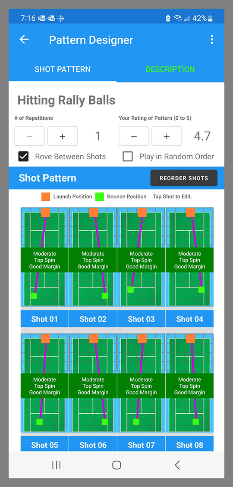
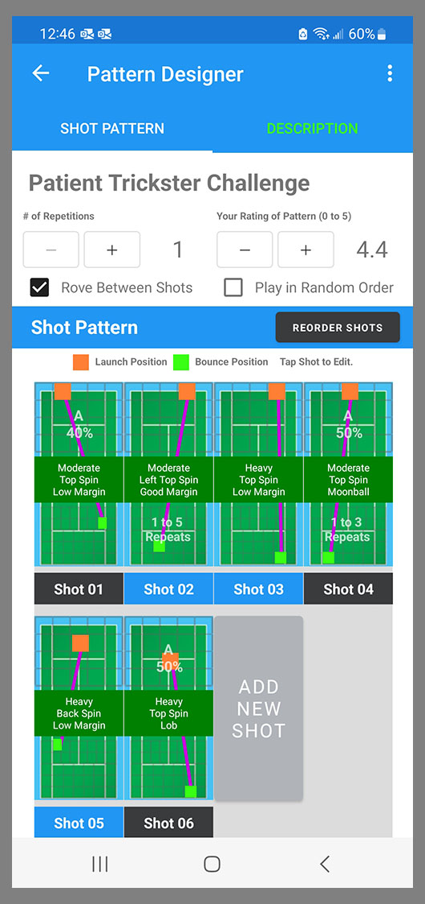
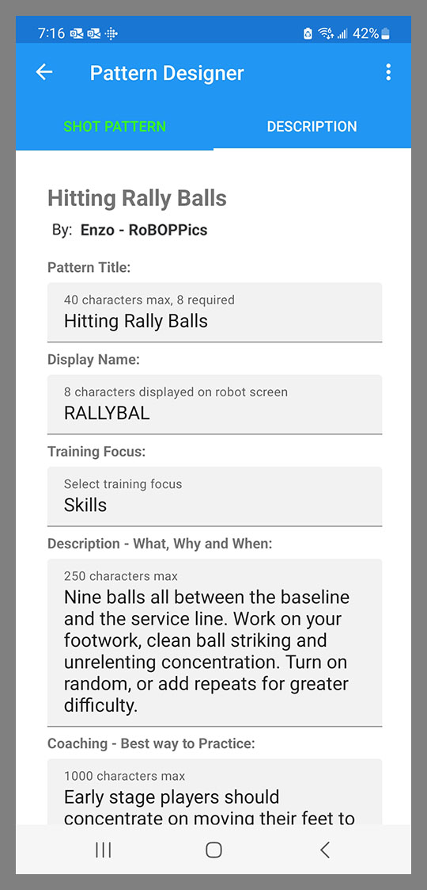

When you tap on a pattern in a Pattern Library, it opens up in the Pattern Designer.

The Pattern Designer has three tabs: Shot Pattern, Description and Settings. Tapping on each tab will navigate to that page, or you can swipe to move between each page.

## Shot Pattern
The Shot Pattern shows the shots that make up the pattern, and the order of those shots. 

{: width="300" .align-center }

The display for each shot shows where the ball will be launched from, and where it will bounce. 

The label in the middle of each shot tells you the height above the net, and spin level and angle for that particular shot.

Patterns that employ Probability settings will look a little different.

{: width="300" .align-center }

Shots that have Alternates, will display the letter of the Alternate and its percentage. For instance, Shot 01 shown above is showing the A alternate which has a probability of 40%. The Shot label at the bottom will now be a black button. Tapping that button will cycle through the Alternate shots.

Shots that have a Repeat Range of more than 1, will show the Repeat Range setting. For instance, Shot 02 shown above has a Repeat Range of 1 to 5. This means it will repeat anywhere from 1 to 5 times. See the Probability item under the Shot Designer section of this documentation for more information.

## Description
The Description contains all of the textual data for the Pattern. 

{: width="300" .align-center }

The Pattern Name and Description are displayed in the library view of each Pattern. 

The Pattern Nickname (limited to 8 characters) is displayed on the BallBOPPer's display screen prior to the start of each Drill or Pattern. 

If the Coaching field has content, then a Coaching link will appear at the bottom of the Pattern. Clicking on that link will display the Coaching information in a popup. 

If you are using Voice Control and a Bluetooth headset, the Coaching information can be read back to you by saying "BB Read Coaching". See Voice under the Controller section of this documentation for more information on Voice Control.

The Attribution field or "Byline" is a combination of the Player Name and Player Team that you entered into your Player Profile. See the Profile item under the Community section of this documentation.

  <nav class="pagination">
      <a href="/BallBOPPer/patternLibraries/" class="pagination--pager" title="Pattern Libraries">Previous</a>
      <a href="/BallBOPPer/shotDesigner/" class="pagination--pager" title="Shot Designer">Next</a> 
  </nav>
