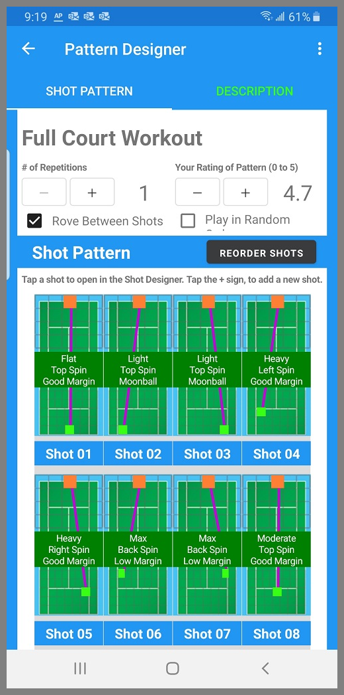
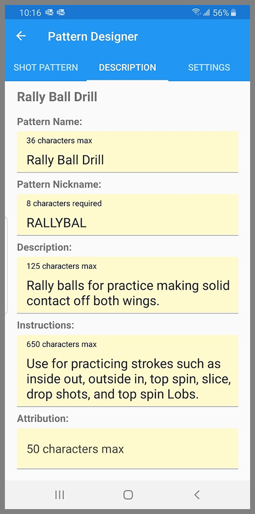

When you tap on a pattern in a Pattern Library, it opens up in the Pattern Designer.

{: width="300" .align-center }

The Pattern Designer has three tabs: Shot Pattern, Description and Settings. Tapping on each tab will navigate to that page, or you can swipe to move between each page.

## Shot Pattern
The Shot Pattern shows the shots that make up the pattern, and the order of those shots. 

The display for each shot shows where the ball will be launched from, and where it will bounce. 

The label in the middle of each shot tells you the height above the net, and spin level and angle for that particular shot.

## Description
The Description contains all of the textual data for the Pattern. 

The Pattern Name and Description are displayed in the library view of each Pattern. The Pattern Nickname is Announced on the BallBOPPer's display screen prior to the start of each Drill or Pattern. The Attribution field is to record the name, website, or twitter handle etc., of the individual or team that developed the Pattern.

{: width="300" .align-center }

  <nav class="pagination">
      <a href="/BallBOPPer/patternLibraries/" class="pagination--pager" title="Pattern Libraries">Previous</a>
      <a href="/BallBOPPer/shotDesigner/" class="pagination--pager" title="Shot Designer">Next</a> 
  </nav>
