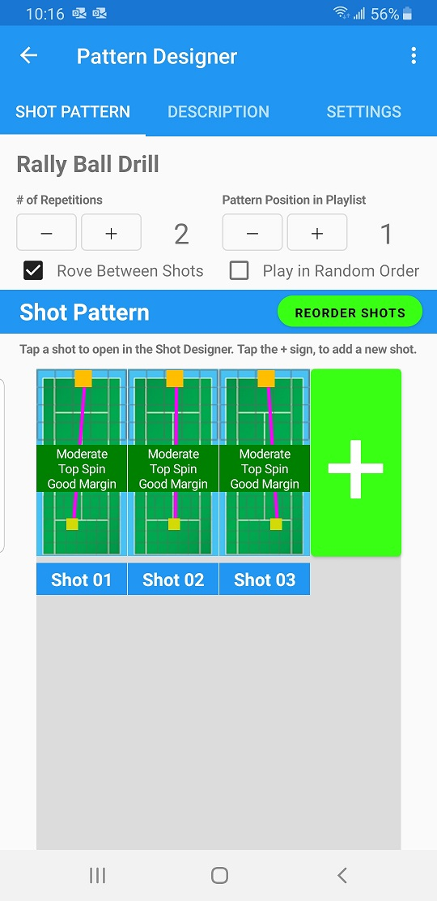

When you tap on a pattern, it opens up in the Pattern Designer.

The Pattern Designer has three tabs: Shot Pattern, Description and Settings.

## Shot Pattern

{: width="300" .align-center }

## Description

{: width="300" .align-center }

## Settings

{: width="300" .align-center }

  <nav class="pagination">
      <a href="/BallBOPPer/patternLibraries/" class="pagination--pager" title="Pattern Libraries">Previous</a>
      <a href="/BallBOPPer/shotDesigner/" class="pagination--pager" title="Shot Designer">Next</a> 
  </nav>
