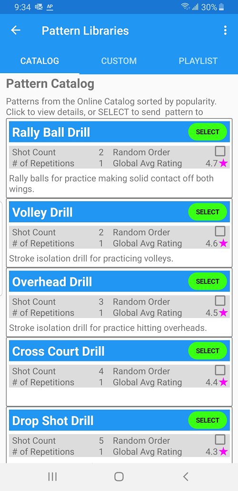
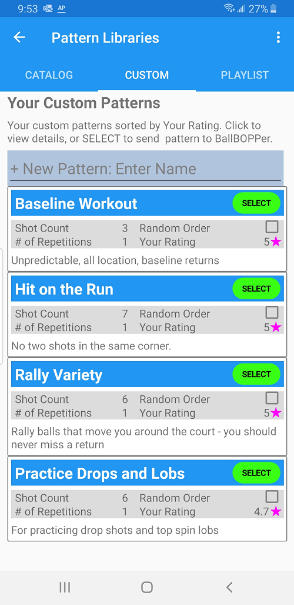
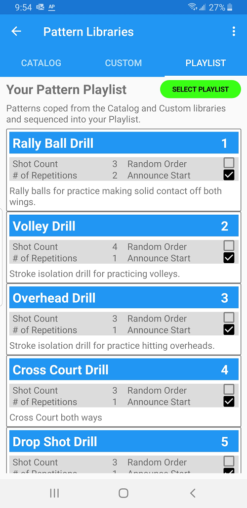

The main screen of the BallBOPPer App is the Pattern Libraries page.

This page has three tabs across the top: Catalog, Custom and Playlist. You can tap each of these tabs to navigate to that page, or you can swipe left and right to navigate between them.

{: width="300" .align-center } 

## Catalog
The Catalog lists the Drills and Patterns which come with the BallBOPPer out of the box. These Drills and Patterns cannot be edited in the Catalog library, but they can be copied into the Custom and Playlist libraries where they can be edited.

These Patterns fall into two general types: Drills and “Patterns of Play”.

Drills tend to be very predictable, and are for practicing particular skills in isolation, so those skills become second nature.

Patterns of Play are for practicing tactics and strategy. They are based on different playing styles, and are less predictable, since a big part of match play is being prepared for the unexpected.

The Drills and Patterns listed in the Catalog will change over time as users create and submit their own Drills and Patterns for inclusion. This is accomplished by copying a Drill or Pattern that you have created in the Custom library, into the Catalog library. If approved for inclusion in the catalog, the Drill or Pattern will then appear in the catalog for all BallBOPPer users.

## Custom

{: width="300" .align-center } 

## Playlist
The Playlist is a list of your favorite Drills and Patterns in the order in which you want to play them.

Tapping on "Select Playlist" will transmit the Playlist to the BallBOPPer, and the Robot will then play through the list from first to last.

{: width="300" .align-center } 
