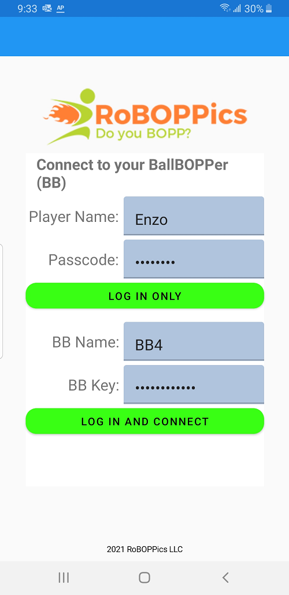

The main screen of the BallBOPPer App is the Pattern Libraries page.

This page has three tabs across the top: Catalog, Custom and Playlist. You can tap each of these tabs to navigate to that page, or you can swipe left and right to navigate between them.

## Catalog

{: width="300" .align-center } 

## Custom

{: width="300" .align-center } 

## Playlist

{: width="300" .align-center } 
