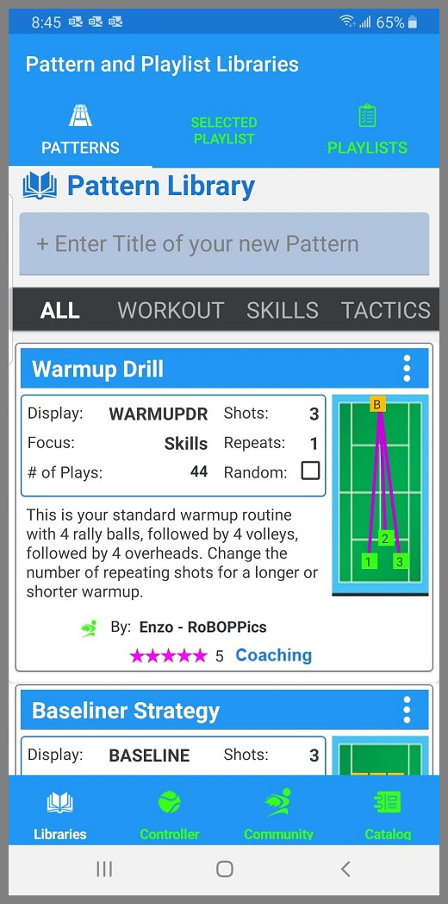
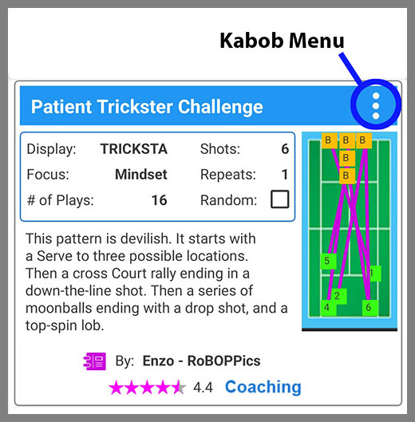
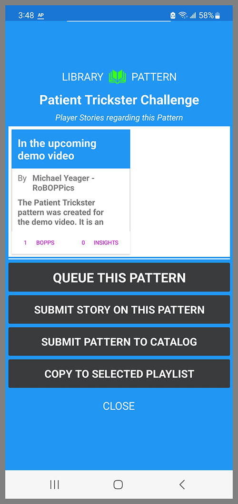
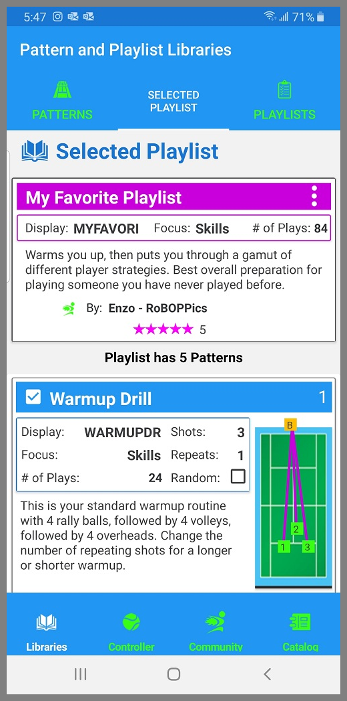
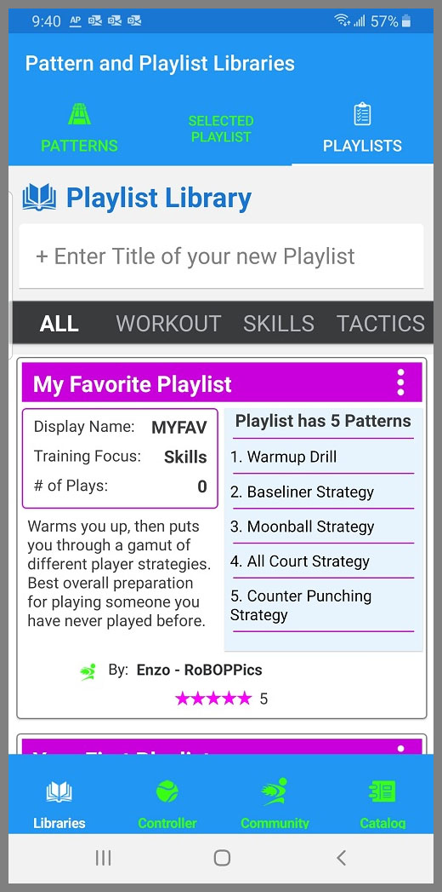
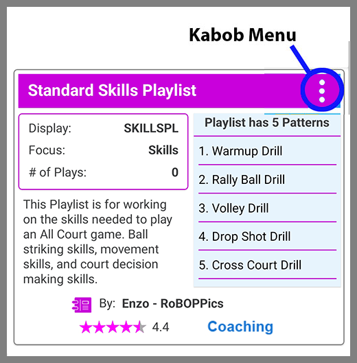
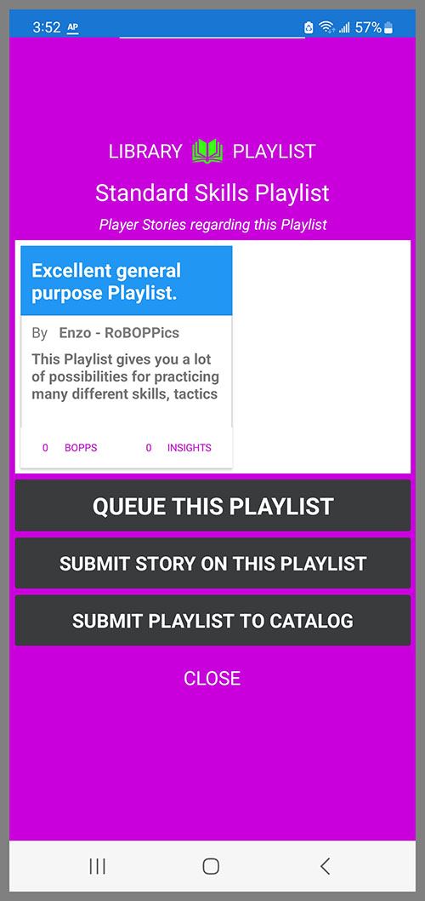

The Patterns and Playlists section has three tabs across the top: Patterns, Selected Playlist and Playlists. You can tap each of these tabs to navigate to that page, or you can swipe left and right to navigate between them.

The BallBOPPer robot and the Pattern Library are all about creating "Patterns of Play".

Patterns of Play are for practicing tactics and strategy. They are based on different playing styles, and are less predictable than drills, since a big part of match play is being prepared for the unexpected.

For more information on Patterns of Play, see the <a href="https://roboppics.com/blogs/news">What are Patterns of Play</a> article in the News section of the RoBOPPics website.

## Pattern Library
The Pattern Library lists the Patterns that you have created, or that you have downloaded from the Pattern and Playlists Catalog. 

{: width="300" .align-center } 

All Patterns in the Pattern Library are editable. Tap on a Pattern and it will open in the Pattern Designer. 

You cannot edit the attribution field for Patterns that have been downloaded from the Pattern and Playlist Catalog, but everything else in Catalog Patterns can be edited to suit your preferences.

## Pattern Kabob Menu

To play a Pattern using the BallBOPPer, tap on the kabob menu (three vertical dots).

{: width="300" .align-center } 

The Pattern menu page will then appear with the options for the selected Pattern.

{: width="300" .align-center } 

## Queue this Pattern

Queueing is the process of transmitting the Pattern (or Playlist) to the BallBOPPer. When you tap on the item "QUEUE THIS PATTERN", the pattern is transmitted to the BallBOPPer where it is placed on the top of the Play queue - next up to be Played.

The Control page will then automatically pop up in the App, and when you click the Play button, the BallBOPPer will begin playing the Pattern.

## Copy to Selected Playlist

When you tap on the "Copy to Selected Playlist" the Pattern will be copied into the selected Playlist.

The selected Playlist is the Playlist that appears under the Selected Playlist tab in the Pattern and Playlist Libraries.

This is how you construct a Playlist. You create a new Playlist and select it in the Playlist Library. It then will be displayed under the Selected Playlist tab. Then go to your Pattern Library, click the Kabob menu on the Pattern you wish to add to your Playlist, and tap "Copy to Selected Playlist". 

You are then forwarded to the Selected Playlist tab where you can see the Pattern has been added to the Playlist. 

Repeat this process to add up to 25 Patterns to the Selected Playlist.

## Selected Playlist

The Selected Playlist is for viewing and editing a Playlist including the individual Patterns in that Playlist. 

{: width="300" .align-center } 

To appear in the Selected Playlist tab, you first go to the Playlist Library, and tap on the Playlist you wish to view or edit.

The Selected Playlist will then display all of the Patterns in the Playlist in the order in which they will be played. 

You can tap on each Pattern to open them in the Pattern Designer where you can view and edit the Pattern and Shot details.

The Patterns in a Playlist are copies. Changes you make to them will not effect the originals in the Pattern Library.

## Playlist Library
The Playlist Library lists all of the Playlists that you have either created or downloaded from the Pattern and Playlist Catalog.

{: width="300" .align-center } 

# Playlist Kabob Menu

To play a Playlist using the BallBOPPer, tap on the kabob menu. 

{: width="300" .align-center } 

The Playlist Kabob Menu will appear.

{: width="300" .align-center }

# Queueing this Playlist

Queueing is the process of transmitting the Playlist to the BallBOPPer. When you tap on the "QUEUE THIS PLAYLIST", the Playlist is transmitted to the BallBOPPer where it is placed on the top of the Play queue.  

The Control page will then automatically pop up in the App, and when you click the Play button, the BallBOPPer will begin playing the Playlist.

The Queue can have a mixture of Patterns and Playlists, but the last item that was Queued is always at the top of the queue - next up to be Played. 

## Submit Story on this Pattern (or Playlist)

This menu item appears on both the Pattern and Playlist Queueing pages and has the same effect.

If you have played a Pattern (or Playlist) a number of times, and wish to provide information for other players, then you can write and submit a Player Story. Tapping on "Submit Story on this Pattern (or Playlist)" will bring up the Story entry form, where you can tap out your story and even add Photos or Videos of you playing this Pattern. 

After approval, these Stories will then show up in the window at the top of the Queueing page, as well as in the Community Feed to help other players decide whether they want to Download and Play the Pattern or Playlist from the Catalog.

All Stories are reviewed before they will appear in the feed to others. Only positive information will be approved.

There is more information on Player Stories in the Community section of this documentation.

## Submit Pattern (or Playlist) to Catalog

This menu item appears on both the Pattern and Playlist Queueing page and has the same effect.

Submitting a Pattern or Playlist to the Catalog will upload it into the online Catalog. 

After it is approved, it will then appear to all users for downloading and playing.

You can only submit a Pattern or Playlist to the Catalog that you have authored. When you open a Pattern that someone else authored, even if you have modified it, this menu item will not appear. 

The "Submit Pattern (or Playlist) to Catalog" item will continue to appear on the items that you have authored after submitting to the Catalog. This allows you to upload newer versions which will replace the original version in the Catalog.

  <nav class="pagination">
      <a href="/BallBOPPer/appmanconnect/" class="pagination--pager" title="Login">Previous</a>
      <a href="/BallBOPPer/patternDesigner/" class="pagination--pager" title="Pattern Designer">Next</a> 
  </nav>
