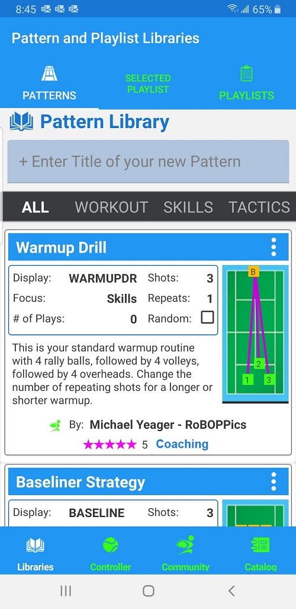
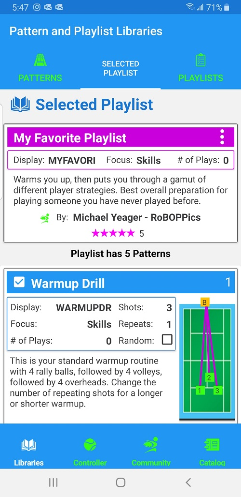
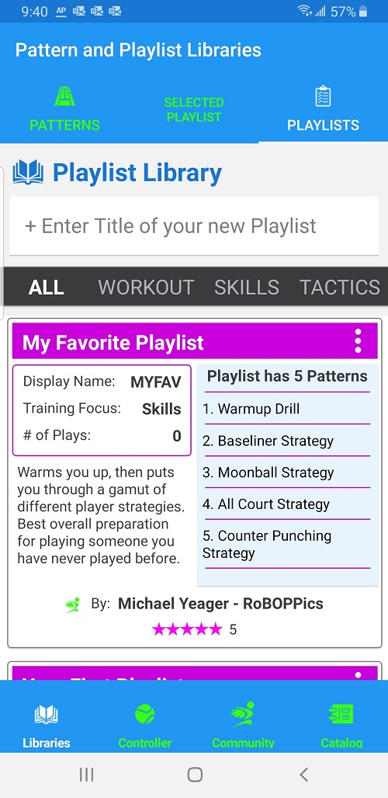

The main screen of the BallBOPPer App is the Pattern Libraries page.

This page has three tabs across the top: Patterns, Selected Playlist and Playlists. You can tap each of these tabs to navigate to that page, or you can swipe left and right to navigate between them.

{: width="300" .align-center } 

## Pattern Library
The Pattern Library lists the Patterns that you have created, or that you have downloaded from the Pattern and Playlists Catalog. 

{: width="300" .align-center } 

To play a Pattern using the BallBOPPer, tap on the kabob menu (three vertical dots), and select "Queue this Pattern". The Controller page will appear. Press Play and the BallBOPPer will begin playing the Pattern. 

See the "Pattern and Playlist Queueing" section for more information. 

Patterns of Play are for practicing tactics and strategy. They are based on different playing styles, and are less predictable, since a big part of match play is being prepared for the unexpected.

All Patterns in the Pattern Library are editable. You cannot edit the attribution field for Patterns that have been downloaded from the Pattern and Playlist Catalog, but everything else in these Patterns can be edited to suit your preferences.

## Selected Playlist
The Selected Playlist is for viewing and editing a Playlist including the individual Patterns in that Playlist. To appear in the Selected Playlist tab, you must first go to the Playlist Library, and tap on the Playlist you wish to view or edit.

To play the Selected Playlist using the BallBOPPer, tap on the kabob menu (three vertical dots), and select "Play this Playlist".

{: width="300" .align-center } 

## Playlist Library
The Playlist Library lists all of the Playlists that you have either created or downloaded from the Pattern and Playlist Catalog.

To play a Playlist using the BallBOPPer, tap on the kabob menu (three vertical dots), and select "Queue this Playlist". The Controller page will appear. Press Play and the BallBOPPer will begin playing the Playlist. See the "Pattern and Playlist Queueing" section for more information. 

{: width="300" .align-center } 

  <nav class="pagination">
      <a href="/BallBOPPer/appmanconnect/" class="pagination--pager" title="Login">Previous</a>
      <a href="/BallBOPPer/patternDesigner/" class="pagination--pager" title="Pattern Designer">Next</a> 
  </nav>
