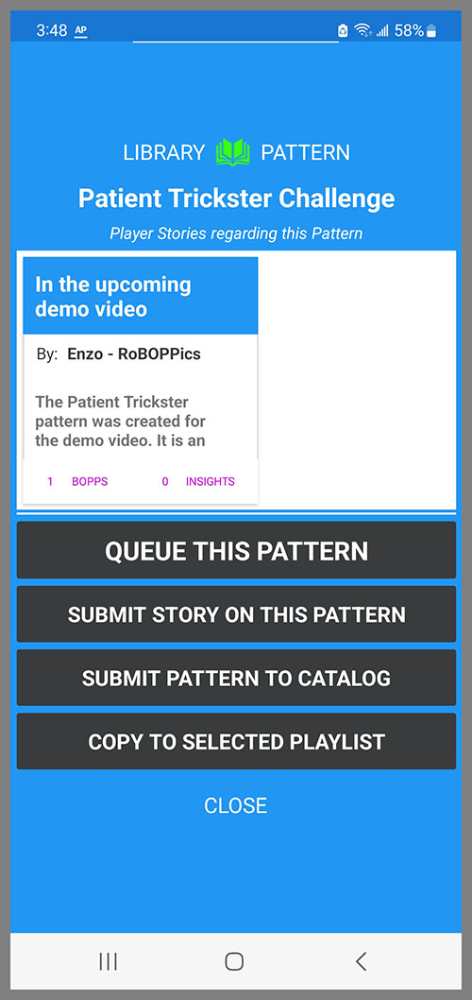

The Patterns and Playlists section has three tabs across the top: Patterns, Selected Playlist and Playlists. You can tap each of these tabs to navigate to that page, or you can swipe left and right to navigate between them.

The BallBOPPer robot and the Pattern Library are all about creating "Patterns of Play".

Patterns of Play are for practicing tactics and strategy. They are based on different playing styles, and are less predictable than drills, since a big part of match play is being prepared for the unexpected.

For more information on Patterns of Play, see the <a href="https://roboppics.com/blogs/news">What are Patterns of Play</a> article in the News section of the RoBOPPics website.

## Pattern Library
The Pattern Library lists the Patterns that you have created, or that you have downloaded from the Pattern and Playlists Catalog. 

{: width="300" .align-center } 

To play a Pattern using the BallBOPPer, tap on the kabob menu (three vertical dots).

{: width="300" .align-center } 

The Pattern menu page will then appear with the options for the selected Pattern.

{: width="300" .align-center } 

All Patterns in the Pattern Library are editable. Tap on a Pattern and it will open in the Pattern Designer. 

You cannot edit the attribution field for Patterns that have been downloaded from the Pattern and Playlist Catalog, but everything else in Catalog Patterns can be edited to suit your preferences.

## Queue this Pattern

Queueing is the process of transmitting the Pattern (or Playlist) to the BallBOPPer. When you tap on the item "QUEUE THIS PATTERN", the pattern is transmitted to the BallBOPPer where it is placed on the top of the Play queue - next up to be Played.

The Control page will then automatically pop up in the App, and when you click the Play button, the BallBOPPer will begin playing the Pattern.

## Copy to Selected Playlist

When you tap on the "Copy to Selected Playlist" the Pattern will be copied into the selected Playlist.

The selected Playlist is the Playlist that appears under the Selected Playlist tab in the Pattern and Playlist Libraries.

This is how you construct a Playlist. You create a new Playlist and select it in the Playlist Library. It then will be displayed under the Selected Playlist tab. Then go to your Pattern Library, click the Kabob menu on each Pattern you wish to add to your Playlist, and then select "Copy to Selected Playlist". 

You are then forwarded to the Selected Playlist tab where you can see the Pattern has been added to the Playlist. Repeat this process to add as many Patterns as you want to the Selected Playlist.

## Selected Playlist

The Selected Playlist is for viewing and editing a Playlist including the individual Patterns in that Playlist. To appear in the Selected Playlist tab, you must first go to the Playlist Library, and tap on the Playlist you wish to view or edit.

{: width="300" .align-center } 

Here you can see all of the Patterns that make up the Playlist. You can drill down in each to see how they are set up. And you can edit them. 

Note that Patterns in a Playlist are copies. Changes you make to them will not effect the originals in the Pattern Library.

## Playlist Library
The Playlist Library lists all of the Playlists that you have either created or downloaded from the Pattern and Playlist Catalog.

{: width="300" .align-center } 

To play a Playlist using the BallBOPPer, tap on the kabob menu (three vertical dots) and Playlist Queueing page will appear. 

{: width="300" .align-center } 

Tap the "Queue this Playlist" and after tranmitting the Playlist to the BallBOPPer, the Controller page will appear. 

Press Play on the Controller and the BallBOPPer will begin playing the Playlist. See the "Pattern and Playlist Queueing" section for more information. 

  <nav class="pagination">
      <a href="/BallBOPPer/appmanconnect/" class="pagination--pager" title="Login">Previous</a>
      <a href="/BallBOPPer/patternDesigner/" class="pagination--pager" title="Pattern Designer">Next</a> 
  </nav>
