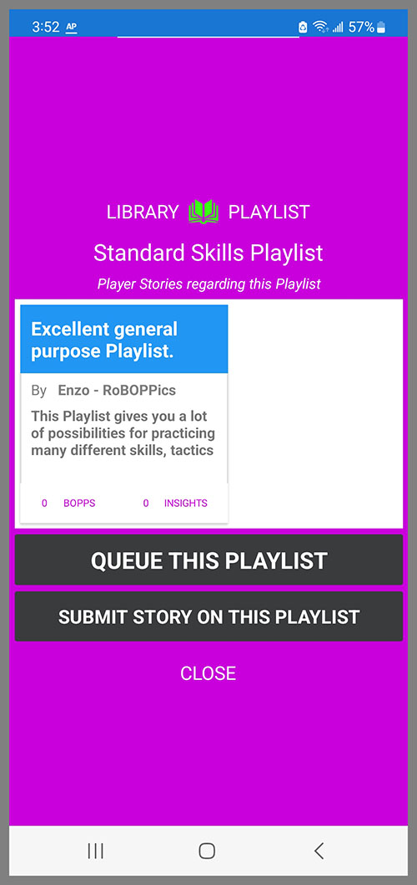

## Queueing

When you tap on the kabob menu on a Pattern in the Pattern Library, you get the Queueing page for the selected Pattern.

Queueing is the process of transmitting the Pattern (or Playlist) to the BallBOPPer where it is placed on the top of Play queue. Next up to be Played.

{: width="300" .align-center } 

When you tap on the kabob menu on a Playlist in the Playlist Library, you get the Queueing page for the selected Playlist.

Queueing is the process of transmitting the Playlist to the BallBOPPer where it is placed on the top of Play queue.  The Queue can have a mixture of Patterns and Playlists, but the last item that was Queued is always at the top. Next up to be Played.

{: width="300" .align-center }

When you press "Queue this Pattern" in a Patterns kabob menu, the Pattern is transmitted to the robot, and queued on the BallBOPPer for playing. The Controller page will then pop up automatically in the App. Press PLAY and the robot will begin playing the Pattern. 

  <nav class="pagination">
      <a href="/BallBOPPer/shotDesigner/" class="pagination--pager" title="Shot Designer">Previous</a>
      <a href="/BallBOPPer/coreController/" class="pagination--pager" title="Core Controller">Next</a> 
  </nav>
