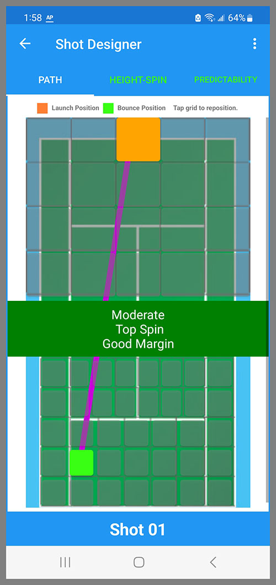
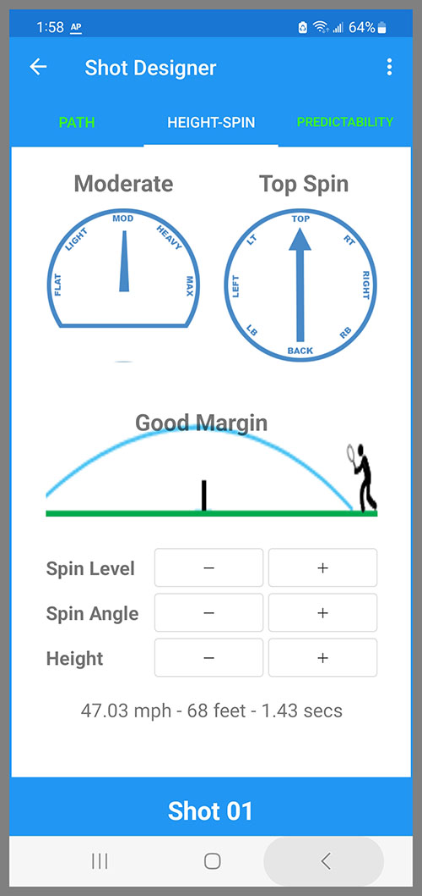
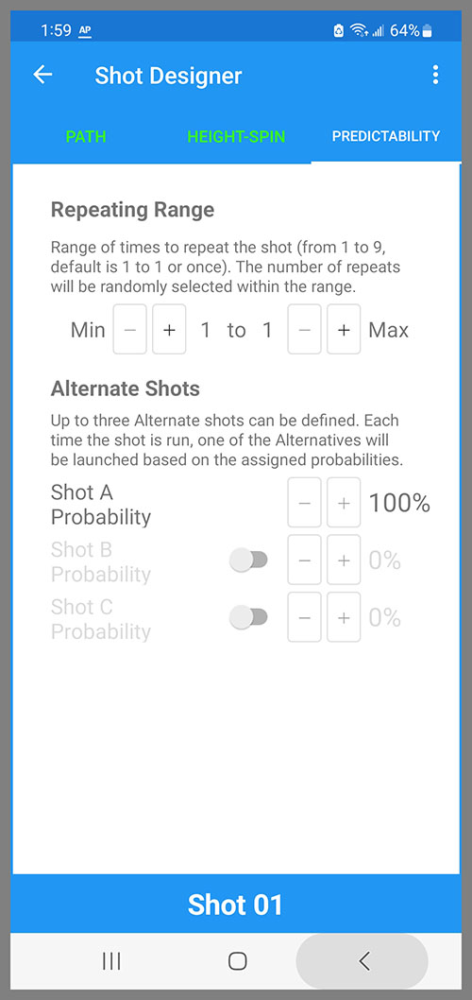

The Shot Designer opens when you tap on a Shot in the Pattern Designer. 

It has three tabs: Path, Height-Spin, and Predictability. You can tap on each tab to navigate to each page, or you can swipe.

## Path
The Path screen shows the plan view of a tennis court with the BallBOPPer (large orange box) at the opposite side of the court, and the bounce point of the ball (small light green box) on your side of the court. 

There are 20 different launch points, and 37 different bounce points to choose from. To select the launch and bounce points just tap the desired spot or zone on the screen.

{: width="300" .align-center }

## Height-Spin

The Height and Spin page lets you specify: the Height that the ball will travel above the net, and the Spin Level and Spin Angle. 

Height can be set to Low Margin, Good Margin, High Margin, Lob and Moonball. Spin Level can be Flat, Light, Moderate, Heavy and Max. Spin Angle can be set every 45 degrees from Top Spin to Back Spin and back.

{: width="300" .align-center }

## Predictability

The Predictability tab provides two important ways you can make your patterns less predictable. 

The Alternate Shots lets you set two or three different shots for a single shot. The system will pick one of the two or three Alternates at launch time based on the probabilies you set. They might be as simple as a shot down the left, a shot down the right, and a shot down the middle; or as complicated as a dropshot, a topspin lob, and a moonball. You may know what the Alternate shots are, but you won't know when each is coming. You have to always be ready for all of them. 

The Repeating Range feature lets you repeat a shot an indeterminant number of times up to 9. For example, if you set the range with a Min of 3 and a Max of 7, then the possibilities are 3, 4, 5, 6, and 7. The BallBOPPer will randomly pick one of these numbers at launch time. If it picks 6, then the shot will repeat 6 times. If these are, for instance, cross court rally shots, and you follow it with a drop shot, then you will not know when the drop shot shot will happen. Again, you have to always be ready for it.

You can also use Alternate Shots and Repeating Range together on the same shot. The shot can be set to repeat multiple times, and each time, the BallBOPPer will pick a new Alternate based on the probabilities. Which basically means by adding Alternates, and repeating it up to 9 times, you can create a very challenging Pattern that only has one shot. 

{: width="300" .align-center }

  <nav class="pagination">
      <a href="/BallBOPPer/patternDesigner/" class="pagination--pager" title="Pattern Designer">Previous</a>
      <a href="/BallBOPPer/coreController/" class="pagination--pager" title="Core Controller">Next</a> 
  </nav>
