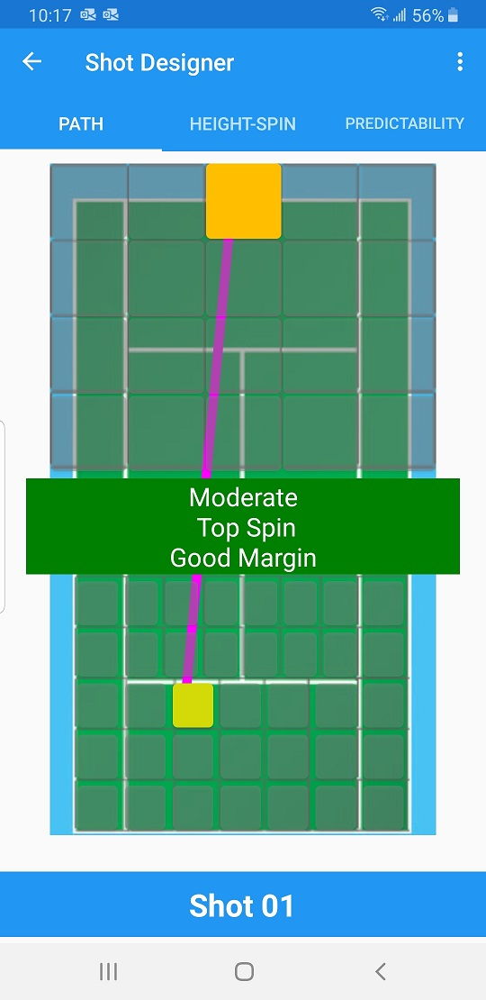
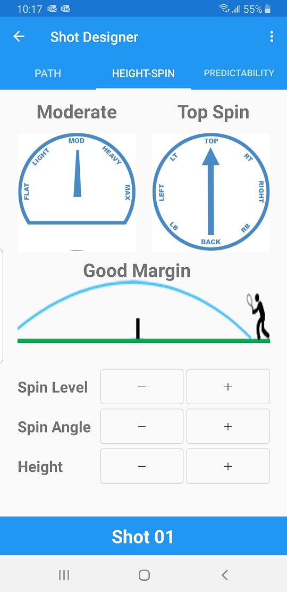
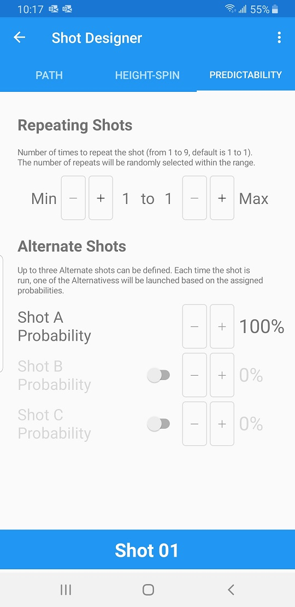

The Shot Designer opens when you tap on a Shot in the Pattern Designer. 

It has three tabs: Path, Height-Spin, and Predictability. You can tap on each tab to navigate to each page, or you can swipe.

## Path
The Path screen shows the plan view of a tennis court with the BallBOPPer (large orange box) at the opposite side of the court, and the bounce point of the ball (small yellow box) on your side of the court. There are 20 different launch points, and 37 different bounce points to choose from. To select the launch and bounce points just tap the spot on the screen.

{: width="300" .align-center }

## Height-Spin

The Height and Spin page lets you specify: the Height that the ball will travel above the net, and the Spin Level and Spin Angle. 

Height can be set to Low Margin, Good Margin, High Margin, Lob and Moonball. Spin Level can be Flat, Light, Moderate, Heavy and Max. Spin Angle can be set every 45 degrees from Top Spin to Back Spin and back.

{: width="300" .align-center }

## Predictability

The Predictability tab provides two important ways you can make your patterns less predictable. The Alternate Shots lets you set three different shots for a single shot. The system will pick one of the three Alternates at launch time based on the probabilies you set. The Repeated Shot feature lets you repeat a shot an indeterminant number of times. Both of these are more advanced and will be demonstrated in detail in the Demo Video that is coming in Spring of 2022.

{: width="300" .align-center }

  <nav class="pagination">
      <a href="/BallBOPPer/patternDesigner/" class="pagination--pager" title="Pattern Designer">Previous</a>
      <a href="/BallBOPPer/coreController/" class="pagination--pager" title="Core Controller">Next</a> 
  </nav>
