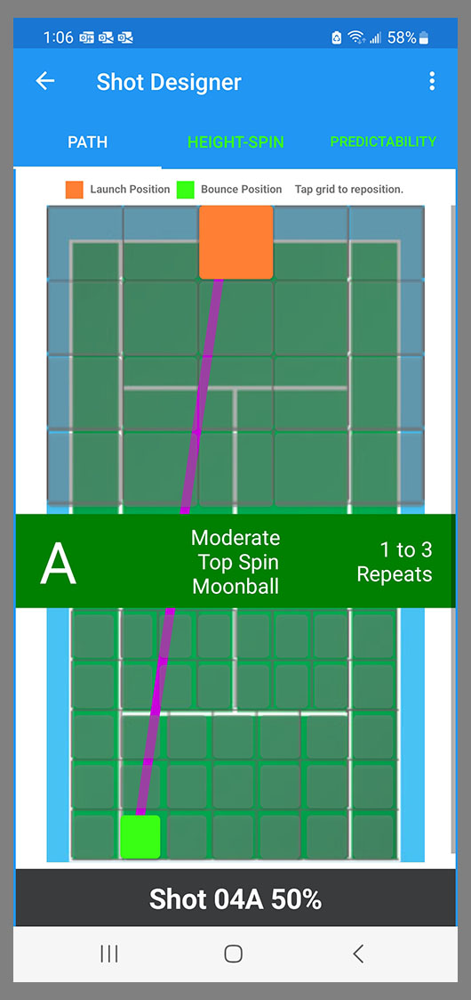
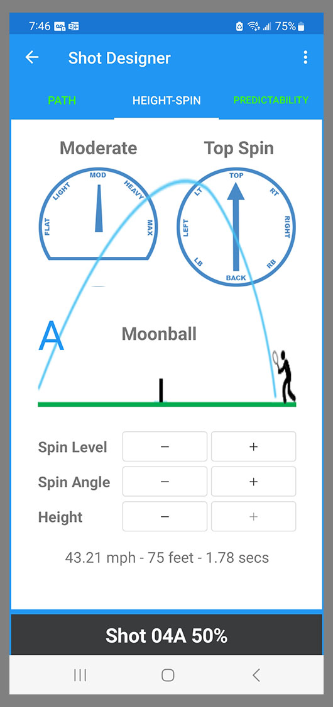
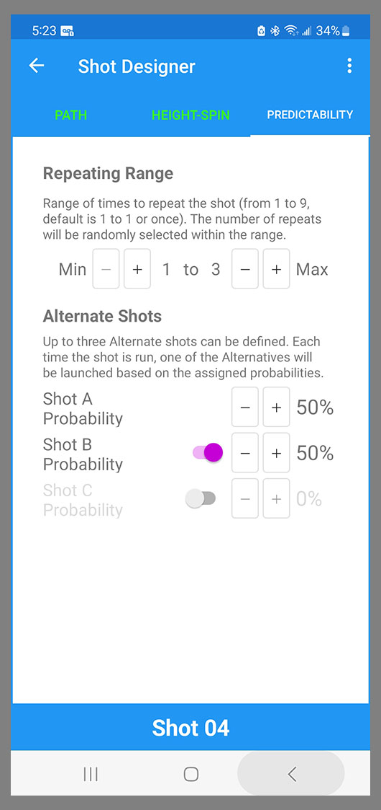

When you tap a Shot in the Pattern Designer, it opens in the Shot Designer. 

The Shot Designer has three tabs: Path, Height-Spin, and Predictability. You can tap on each tab to navigate to each page, or you can swipe.

## Path
The Path screen shows the plan view of a tennis court with the BallBOPPer (large orange box) at the opposite side of the court, and the bounce point of the ball (small light green box) on your side of the court. 

{: width="300" .align-center }

There are 20 different launch points, and 37 different bounce points to choose from. To select the launch and bounce points just tap the desired spot or zone on the screen.

Shots that employ Predictability settings will look a little different.

{: width="300" .align-center }

A Shot that has Alternates will show the letter of the Alternate on the left side of the center label. The "A" as shown above. 

The Shot label for a Shot with Alternates is a black button that displays the Alternate probability percentage - 50% in this case. If you tap that button, you will cycle through the Alternate shots.

A shot that has a Repeating Range of more than 1, will display the Repeating Range on the right side of the center label. The label on the image above shows that this Shot has "1 to 3 Repeats".

More information on Repeating Range and Alternates can be found below under the Predictability item below.

## Height-Spin

The Height and Spin page lets you specify: the Height that the ball will travel above the net, and the Spin Level and Spin Angle. 

{: width="300" .align-center }

Height can be set to Low Margin, Good Margin, High Margin, Lob and Moonball. 

Spin Level can be Flat, Light, Moderate, Heavy and Max. 

Spin Angle can be set every 45 degrees from Top Spin to Back Spin and back.

## Predictability

The Predictability tab provides two important ways you can make your patterns less predictable. 

{: width="300" .align-center }

The Alternate Shots lets you set two or three different shots for a single shot. The system will pick one of the two or three Alternates at launch time based on the probabilities you set. 

The Alternates might be as simple as a shot down the left, a shot down the right, and a shot down the middle; or as complicated as a dropshot, a topspin lob, and a moonball. 

The Repeating Range feature lets you repeat a shot an indeterminant number of times up to 9. For example, if you set the range with a Min of 3 and a Max of 7, then the possibilities are 3, 4, 5, 6, and 7. 

The BallBOPPer will randomly pick one of these numbers at launch time. If it picks 6, then the shot will repeat 6 times. If the repeating shot is, for instance, a cross court rally shot, and you follow it with a drop shot, then you will not know when the drop shot is going to happen. You just have to be ready.

You can also use Alternate Shots and Repeating Range together on the same shot. The shot can be set to repeat multiple times, and each time, the BallBOPPer will pick one of the Alternates based on the probabilities. 

  <nav class="pagination">
      <a href="/BallBOPPer/patternDesigner/" class="pagination--pager" title="Pattern Designer">Previous</a>
      <a href="/BallBOPPer/coreController/" class="pagination--pager" title="Core Controller">Next</a>  
  </nav>
