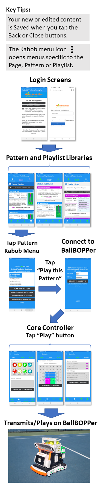
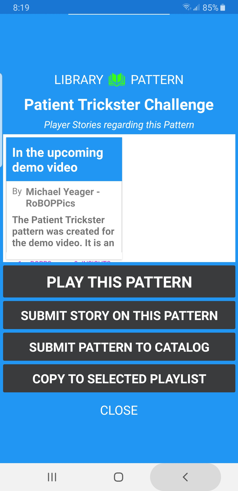
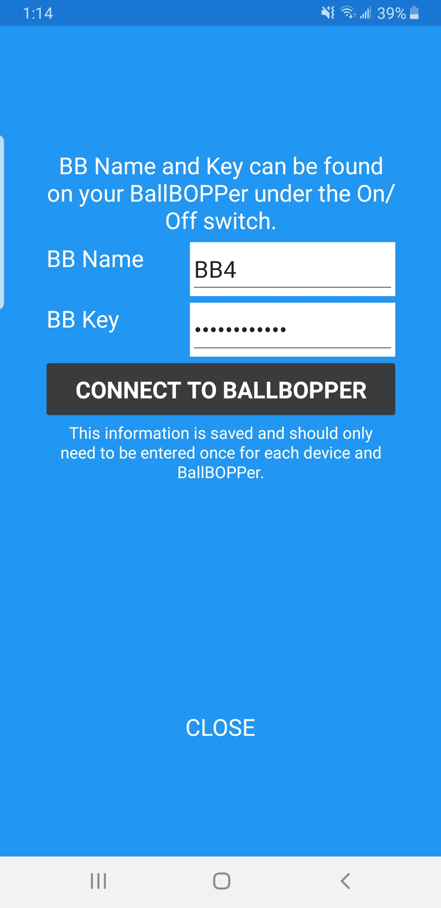
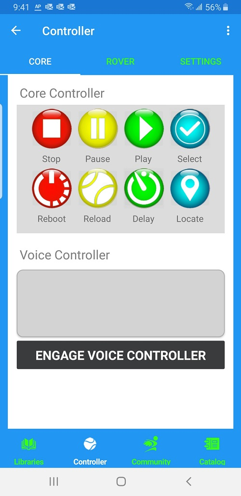

To familiarize yourself with the BallBOPPer system, start by playing a Pattern as illustrated below.

{: width="400" .align-center } 

After Login, you are forwarded to the Pattern and Playlist Libraries. A set of Patterns and Playlists are preloaded. You can edit and play these, and you can create and play your own custom Patterns and Playlists. 

If you tap on a Drill or Pattern in a Pattern Library it will open in the Pattern Designer. In the Pattern Designer you can see the flow of the shots and the configuration of each shot. Here can add new Shots, or edit the order of the Shots.

If you tap on a Shot within the Pattern Designer, it will open in the Shot Designer. In the Shot Designer you can see the path, height, spin and predictability of each shot.

When you are ready to run a Pattern, tap on the kebab menu icon (three vertical dots) in the top right corner of the Pattern, and then select the "PLAY THIS PATTERN" item as shown in the following screen. 

{: width="300" .align-center } 

If you are not already connected to the BallBOPPer, then you will be presented with the connection screen where you will need to enter your BallBOPPer's name and key. This information is included with your BallBOPPer.

{: width="300" .align-center }

Once connected, the Pattern or Playlist will be transmitted to the BallBOPPer, and the Core Controller will appear on the screen. 

{: width="300" .align-center }

When you are ready start, tap the PLAY button and the BallBOPPer will begin playing the pattern.

  <nav class="pagination">
      <a  class="pagination--pager disabled">Previous</a>
      <a href="/BallBOPPer/appmanconnect/" class="pagination--pager" title="Connect">Next</a> 
  </nav>
