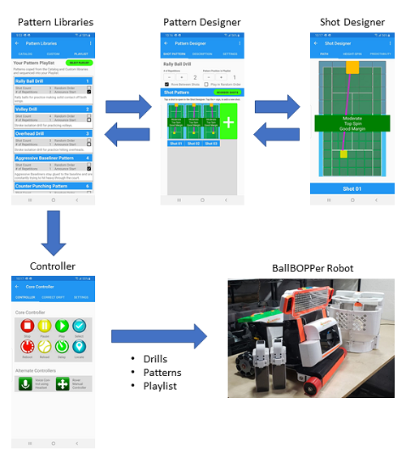

The BallBOPPer App is not yet publicly available.  

After the BallBOPPer Kickstarter launch (Summer of 2022), the BallBOPPer App will be available in the Google Play Store, the Apple App Store and the Amazon App Store.  

The BallBOPPer App reference documentation is for Players and Coaches looking to understand how "Patterns of Play" are designed and run using the App.

{: width="400" .align-center } 

Use the NEXT button to move to the first section of the App Reference.

  <nav class="pagination">
      <a  class="pagination--pager disabled">Previous</a>
      <a href="/BallBOPPer/appmanconnect/" class="pagination--pager" title="Connect">Next</a> 
  </nav>
