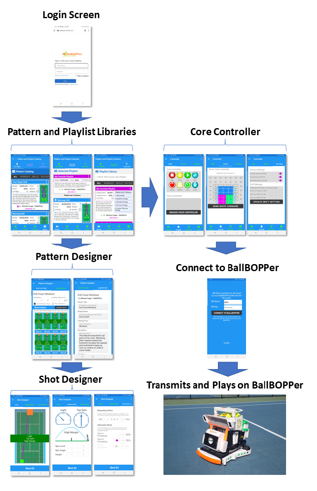

The BallBOPPer App is currently available for testing on Android in the Google Play Store: <a href="https://play.google.com/store/apps/details?id=com.RoBOPPics.bbapp18" >BallBOPPer App on Android</a> 

After the BallBOPPer Kickstarter launch, the BallBOPPer App will be available in the Google Play Store, the Apple App Store and the Microsoft App Store.  

The BallBOPPer App reference documentation is for Players and Coaches looking to understand how "Patterns of Play" are designed and run using the App.

The information flow using the BallBOPPer App is illustrated below.

{: width="400" .align-center } 

The Pattern Libraries hold all of your "ready to run" Drills and Patterns. 

If you tap on a Drill or Pattern in a Pattern Library it opens in the Pattern Designer. In the Pattern Designer you can see the flow of the shots and the configuration of each shot. 

If you tap on a Shot within the Pattern Designer, it will open in the Shot Designer. In the Shot Designer you can see the path, height, spin and predictability of each shot.

When you are ready to run a Drill or Pattern, tap on the kebab menu icon (three vertical dots) and select the "PLAY THIS PATTERN" item. The Pattern will be transmitted to the BallBOPPer, and the Core Controller will appear on the screen. When you are ready, tap the PLAY button and the BallBOPPer will begin playing the pattern.

  <nav class="pagination">
      <a  class="pagination--pager disabled">Previous</a>
      <a href="/BallBOPPer/appmanconnect/" class="pagination--pager" title="Connect">Next</a> 
  </nav>
