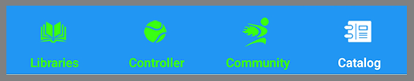

The BallBOPPer App reference documentation is for Players and Coaches looking to understand how "Patterns of Play" are designed and run using the App.

This documentation covers the Libraries, Controller, Community and Catalog sections of the App.

{: width="400" .align-center } 

It also has sections on the Pattern Designer and the Shot Designer. 

The Pattern Designer opens when you tap on a Pattern in the Libraries or Catalog. The Shot Designer opens when you tap on a Shot in the Pattern Designer.

A beta version of the BallBOPPer App is currently available for testing on Android in the Google Play Store: <a href="https://play.google.com/store/apps/details?id=com.RoBOPPics.bbapp18" >BallBOPPer App on Android</a> 

{: width="400" .align-center } 

After the BallBOPPer Kickstarter launch, the release version of the BallBOPPer App will be available in the Google Play Store, the Apple App Store and the Microsoft App Store.  

  <nav class="pagination">
      <a href="/BallBOPPer/appHome/" class="pagination--pager" title="Connect">Previous</a> 
      <a href="/BallBOPPer/appmanconnect/" class="pagination--pager" title="Connect">Next</a> 
  </nav>

