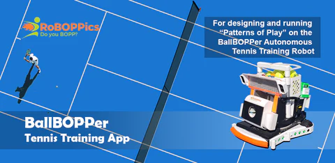

The BallBOPPer App is currently available for testing on Android in the Google Play Store: <a href="https://play.google.com/store/apps/details?id=com.RoBOPPics.bbapp18" >BallBOPPer App on Android</a> 

Much of this beta version can be navigated without logging in. You are invited to click through the App and explore the Pattern and Playlist Libraries, the Community, and the Controller. 

A login is required if you wish to create a new Pattern or add a Story in the Community. An email and password are all that is currently required to create a login. When the BallBOPPer is officially released, this will change, and two factor authentication, requiring a telephone number, will be the new requirement. This is to prevent a nefarious user of the App from hijacking your BallBOPPer robot.

{: width="400" .align-center } 

After the BallBOPPer Kickstarter launch, the BallBOPPer App will be available in the Google Play Store, the Apple App Store and the Microsoft App Store.  

The BallBOPPer App reference documentation is for Players and Coaches looking to understand how "Patterns of Play" are designed and run using the App.

  <nav class="pagination">
      <a  class="pagination--pager disabled">The Beginning</a>
      <a href="/BallBOPPer/appmanconnect/" class="pagination--pager" title="Connect">Next</a> 
  </nav>

