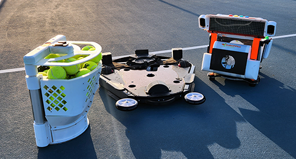

The 2023 prototype of the BallBOPPer autonomous tennis training robot is currently being tested, and is evolving rapidly towards the Kickstarter release.

{: width="400" .align-center } 

A technology demonstration video is expected to be available during the Spring of 2023.

The Kickstarter launch is currently planned for Summer or Fall of 2023.

For the most up to date news on the BallBOPPer hardware, see the <a href="https://roboppics.com/blogs/news">News Section</a> on the RoBOPPics web site.

  <nav class="pagination">
      <a href="/BallBOPPer/appmancatalog/" class="pagination--pager" title="Catalog">Previous</a>
       <a href="/BallBOPPer/robotmanlauncher/" class="pagination--pager" title="Launcher">Next</a>
  </nav>
